# gSheetAgent
An experimental agentic AI assistant for Google Sheets.

## Table of Contents
- [How it works](#how-it-works)
- [Known Limitations](#known-limitations)
- [Privacy Policy](#privacy-policy)
- [How to set up for use](#how-to-set-up-for-use)
- [How to set up for development](#how-to-set-up-for-development)
  - [Prerequisites](#prerequisites)
  - [Getting Started](#getting-started)
  - [Running the Application](#running-the-application)
  - [Deployment](#deployment-optional)
  - [Directory Structure](#directory-structure)
  - [Additional Resources](#additional-resources)
- [License](#license)
- [Contact](#contact)

## How it works
gSheetAgent enables users to describe their desired actions in the spreadsheet, and it utilizes an LLM model to generate the corresponding [Google App Script](https://developers.google.com/apps-script) code. The agent also provides a detailed explanation of the generated code, which users can execute with a click. The code is automatically uploaded to the associated Script project for execution after user review.

## Known Limitations
Below are things the developer is aware of and may address in future releases, especially if there's demand for them:

- The code generation and explanation logic provided by the LLM is very basic with no memory of past actions, no handling of edge cases, no guardrails and low quality in it's explanations.
- The agent only works with OpenAI models at the moment.
- The microphone feature is very basic and doesn't handle pauses in speech very well.

## Privacy Policy
- gSheetAgent does not have a database, it does not store your prompts or the response to them, and does not read or store any information from your spreadsheet or other Google documents. 
- This application currently uses OpenAI's LLM APIs to send your prompts and receive responses. For policies on how OpenAI uses your data, please refer to their [privacy policy](https://openai.com/api/policies/privacy-policy/).
- gSheetAgent uses Mixpanel to track usage information for the purposes of understanding how the app is used, how it can be improved and for support and troubleshooting purposes. Included in the data we collect is the **email address** of the Google account who is using the app. We also collect the **Spreadsheet document ID** for the purposes of associating the usage with the correct user and document. We will never subscribe your email address to any mailing list without your consent and it will not be shared with any third parties. For more information on how Mixpanel uses your data, please refer to their [privacy policy](https://mixpanel.com/privacy/).

## How to set up for use
gSheetAgent needs to create dynamic code for users to run, which means it requires some sensitive permissions in Google Cloud Platform and a bit of manual configuration. Because of this, it can't be published as an official add-on for Google Sheets.

>[!WARNING]
> This is an experimental project. You should use with caution. The generated code can always be reviewed by you before execution. The developer of this project is not responsible for any issues that may occur as a result of using it.

Here are the steps to get this onto **each** of your Google Sheets:

### Step 1. 
Go to your spreadsheet and click on `Extensions` > `Apps Script`
<br/><br/><kbd>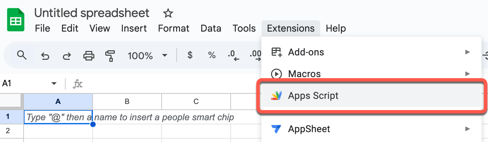</kbd>

### Step 2.
Navigate to the `Project Settings` from the left panel of the Apps Script editor and check the box which reads 'Show "appsscript.json" manifest file in editor'.
<br/><br/><kbd>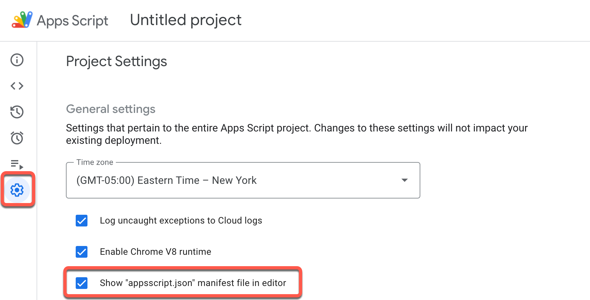</kbd>

### Step 3.
Now we need to associate the new Script project with a Google Cloud Platform project so we can enable the necessary APIs. This is required so the agent can build dynamic code and make it available for the user to run.

<details>
<summary><b>&nbsp; Is this the first time you're setting up gSheetAgent?</b></summary>
<br/>
If this is the first spreadsheet you're setting up with gSheetAgent, there's a few extra steps you need to take. You'll need to create a new Google Cloud Platform project and enable the necessary APIs and setup oAuth access to the GCP project. Here's how you can do this:

1. While on the `Project Settings` of the Apps Script editor, click on `Change project` under the _Google Cloud Platform (GCP) Project_ section.
<br/><br/><kbd>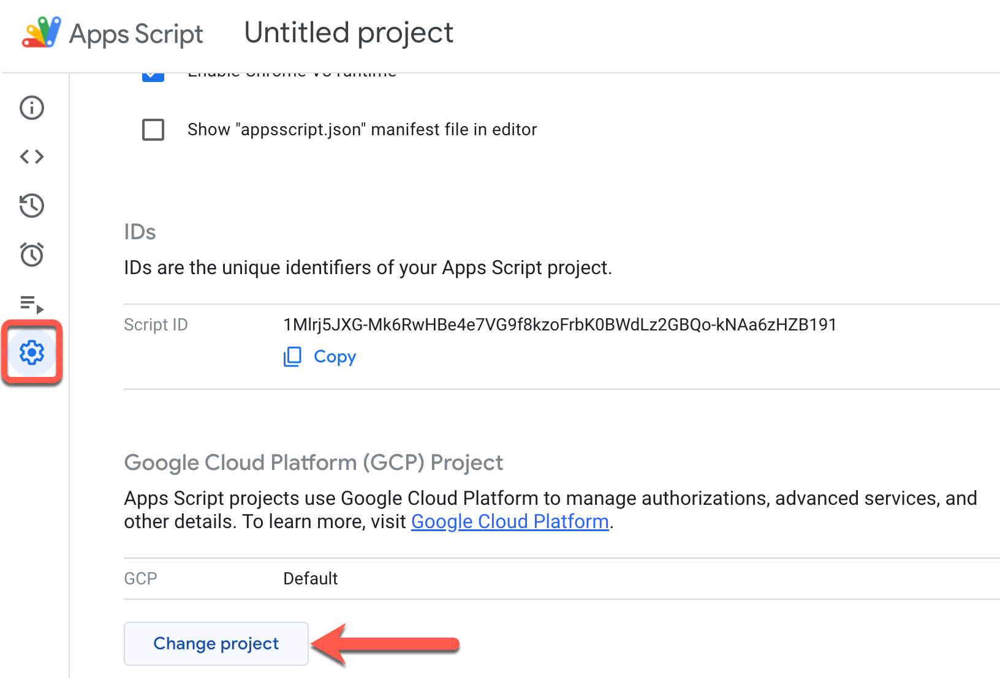</kbd>

2. As instructed on screen, follow the [Google Cloud Console link](https://console.cloud.google.com/home/) and login if necessary.
3. On the Google Cloud Console, create a new GCP project using one of the suggested methods in the screenshot below or by navigating to [the direct link](https://console.cloud.google.com/projectcreate).
<br/><br/><kbd>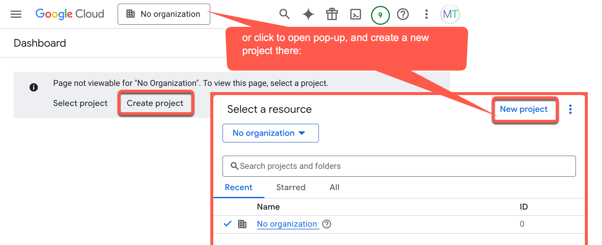</kbd>
4. Specify a name for your project, e.g. `gSheetAgent` - can be anything as long as you remember what it is later.
5. If you're on Google Workspace, you'll need to select an organization that you have access to.
<br/><br/><kbd>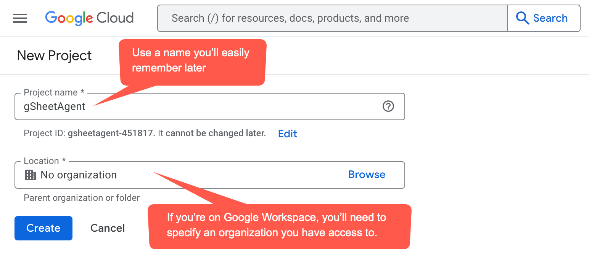</kbd>

6. Once you've created the project, use the search bar to find `App Script API`. <br/>
There are a few different ways to get there including directly navigating to [the direct link](https://console.cloud.google.com/marketplace/product/google/script.googleapis.com). Either way, make sure you're in the context of the project you created in the previous step.
<br/><br/><kbd>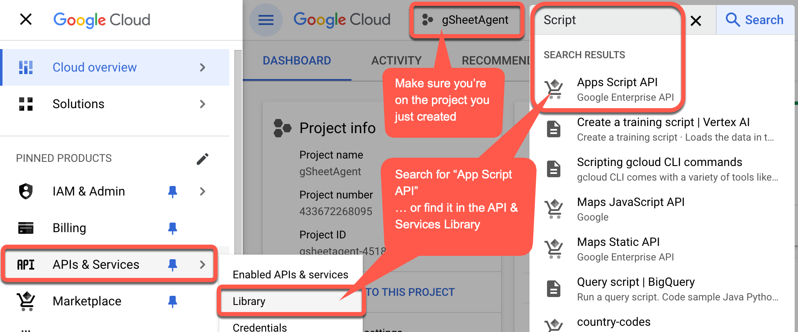</kbd><br/>

7. Enable the App Script API so that gSheetAgent can write code to your Script project.
<br/><br/><kbd>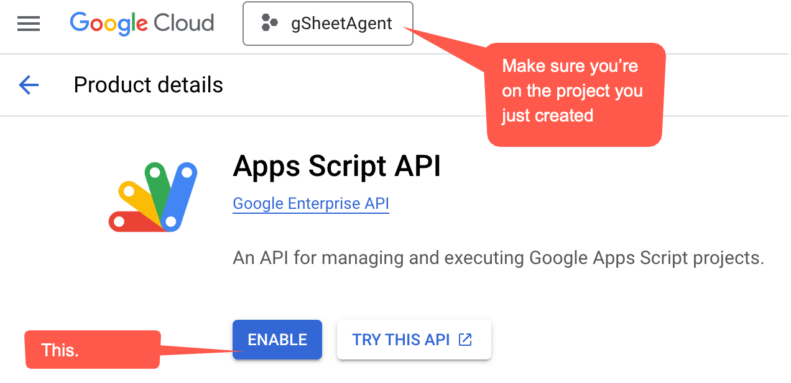</kbd><br/>

8. Now you'll need to setup oAuth access to the GCP project. From the left panel of GCP console, navigate to `API and Services` > `OAuth consent screen`.
<br/><br/><kbd>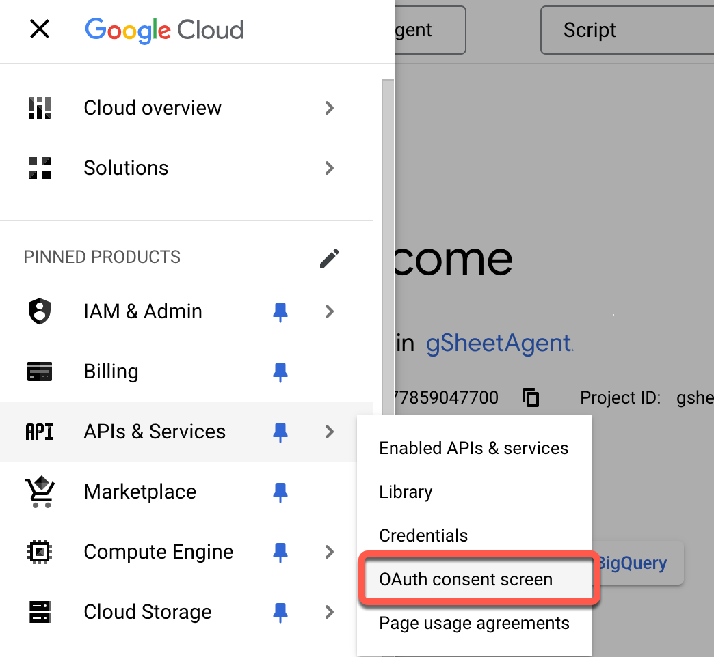</kbd><br/>

9. On the screen that follows, click `Get Started`.
<br/><br/><kbd>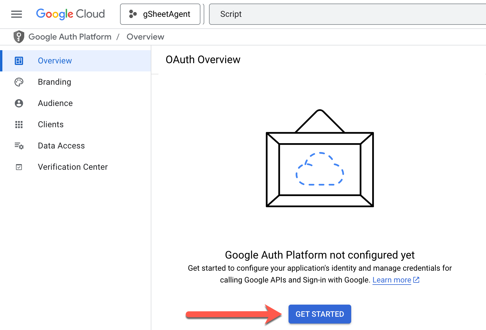</kbd><br/>

10. On item #1, provide an app name you recognize (e.g. `gSheetAgent`), and provide an email address from the list. Proceed to item #2.
<br/><br/><kbd>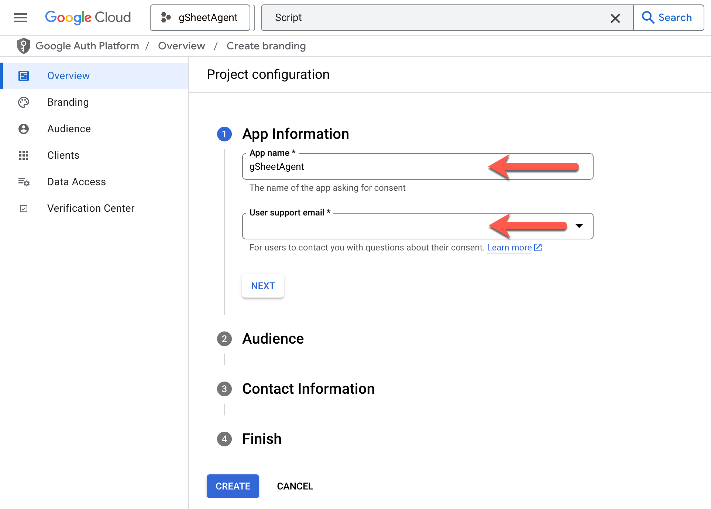</kbd><br/>

11. On item #2, you'll be asked if you want to publish your app internally or externally. We won't actually be publishing anything but if your organization allows to make this available internally, it's the better way to go.
<br/><br/><kbd>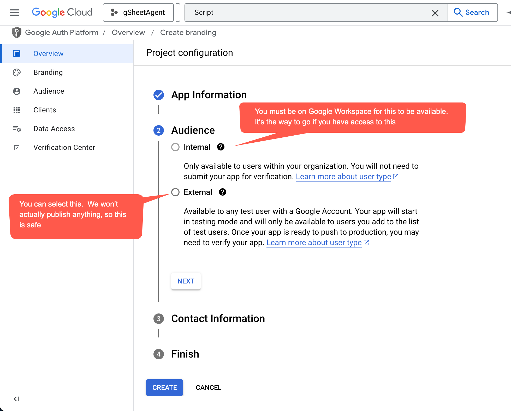</kbd><br/>

12. On item #3, you'll need to provide an email address for any possible alerts Google needs to send you for this app.
<br/><br/><kbd>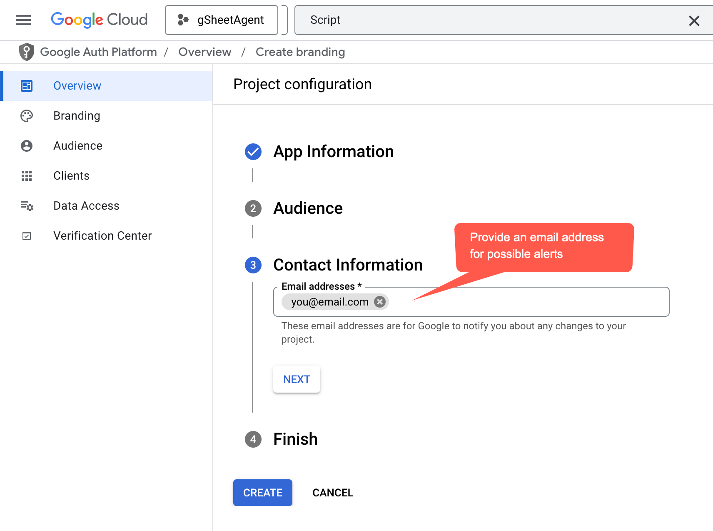</kbd><br/>

13. On item #4, agree to the user data terms and click `Create`.
<br/><br/><kbd>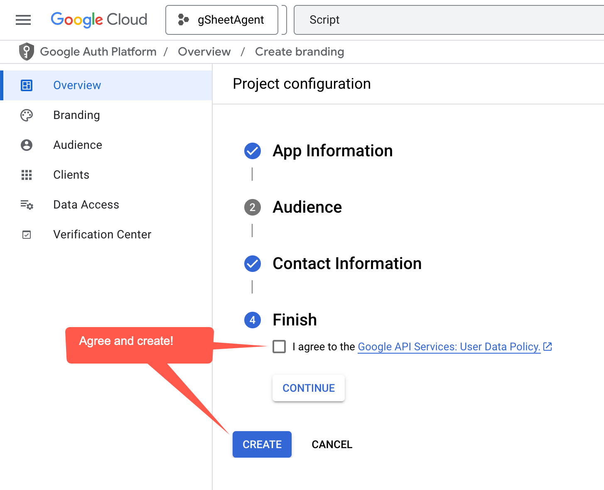</kbd><br/>

14. Now, you have an oAuth configuration which was a requirement for the GCP project to be used for Google App Scripts. In step 11 above, if you had to choose "External" as your audience, you'll need to specify who's allowed to Test the app, otherwise no one can properly access the app. On the oAuth configuration screen, navigate to `Audience` and scroll down to the `Test users` section, then click `Add Users`.
<br/><br/><kbd>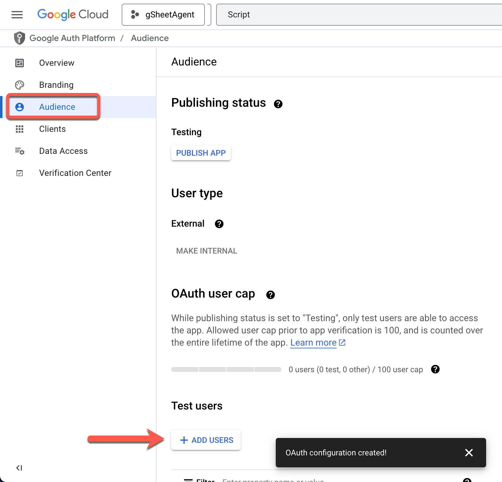</kbd><br/>

15. Add **your** email address to the list, as well as any other person who might need to use gSheetAgent on one of YOUR spreadsheets. Any email address you provide must be on a gmail or Google Workspace account. <br/>
> [!NOTE]
> At the end of this step, you might see a message telling you "Ineligible accounts not added". You can ignore this.

<br/><kbd>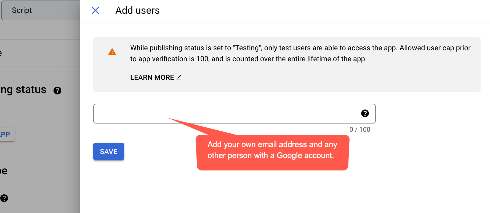</kbd><br/>

16. Go back to the GCP home page and copy the Project number. Make sure you're on the right GCP project.
<br/><br/><kbd>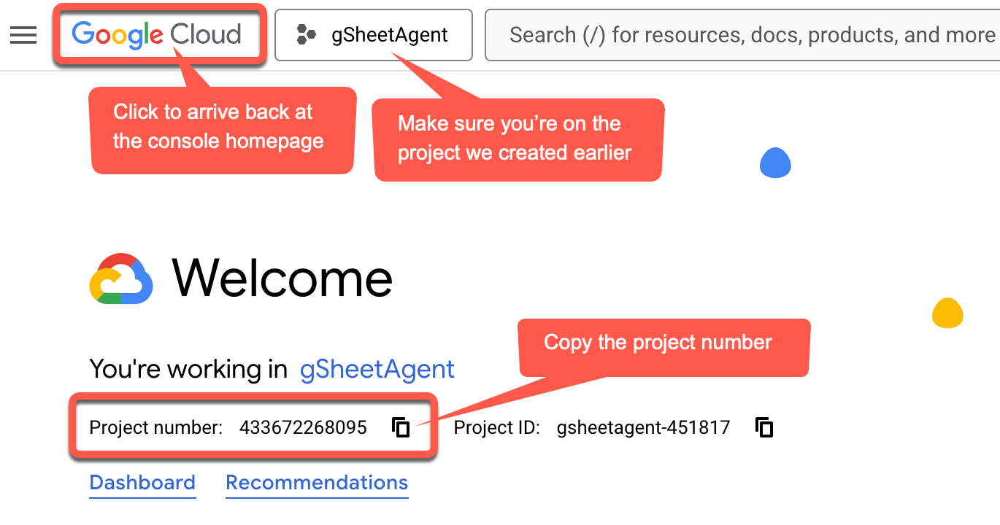</kbd><br/>

17. Navigate back to the Apps Script editor (where you started at on this detour). Paste the Project number into the corresponding field under the _Google Cloud Platform (GCP) project_ section.
<br/><br/><kbd>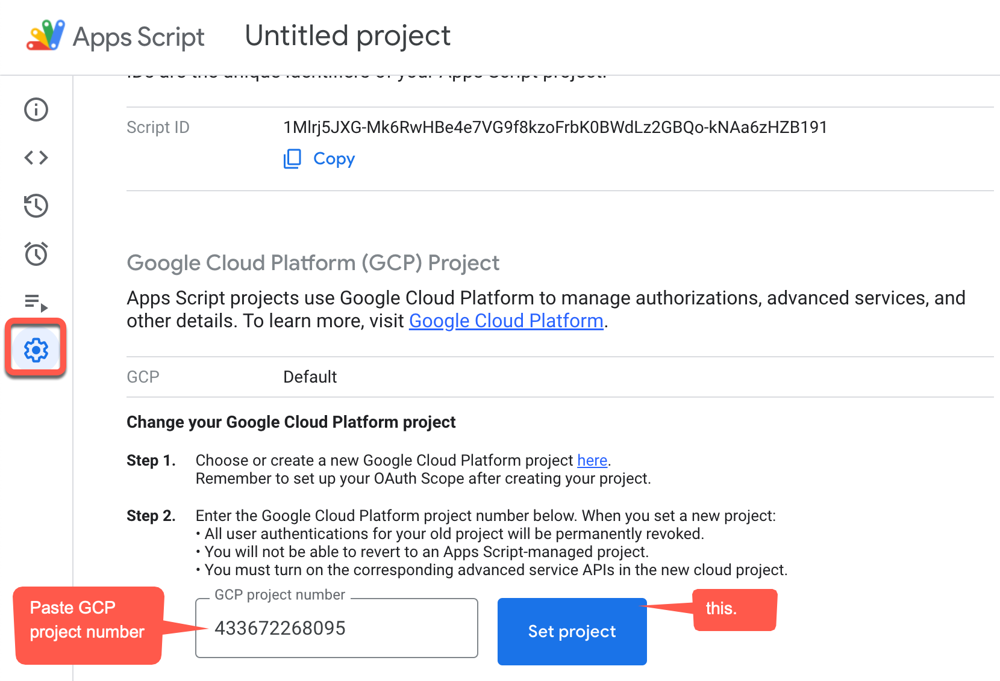</kbd><br/>
<br/>
</details>

<details>
<summary><b>&nbsp; Have you already set up gSheetAgent on another spreadsheet?</b></summary>
<br/>

>[!TIP]
> You can always Make a Copy of an existing Spreadsheet with gSheetAgent already set up and use the new document independently of the original.
> If you prefer to start fresh, read on.

If you've set up gSheetAgent on another spreadsheet, you would have already created a GCP project for it which you can reuse. Here's how you can do this:

1. In a new browser tab, navigate to the [Google Cloud Console](https://console.cloud.google.com/home/) and login if necessary.
2. From the top drop-down, select the project we would have created last time - likely called "gSheetAgent"
3. On the GCP home page copy the Project number.
<br/><br/><kbd></kbd>

4. Go back to the first browser tab, select Project Settings from the left panel of the Apps Script editor and click on `Change project` under the _Google Cloud Platform (GCP) project_ section
5. Paste the Project number into the corresponding field in that section.
<br/><br/><kbd></kbd>
</details>
<br/>

### Step 4.

<details>
<summary><b>&nbsp; Important Note:</b> Does your spreadsheet already have some customized code?</summary>
<br/>
gSheetAgent needs a dedicated Apps Script project. If your spreadsheet already has some customized code, you'll need to create a new Script project and associate it with your spreadsheet before you copy the starter code over. Here's how you can do this:
<br/>

1. Navigate to the Project Overview from the left panel of the Apps Script editor

2. Click on `Make a copy` in the top right corner
<br/><br/><kbd>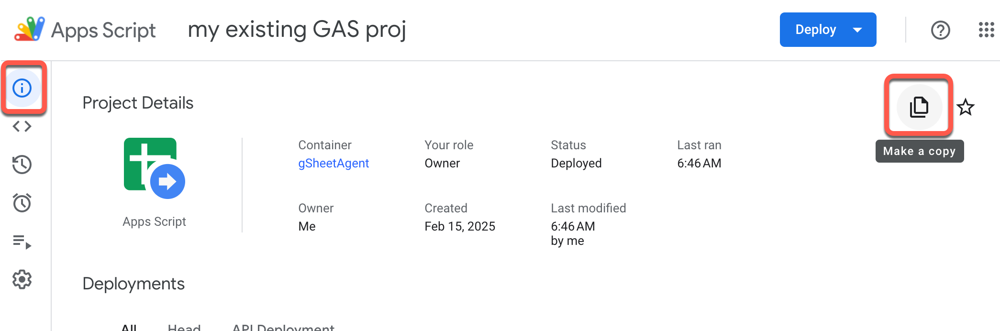</kbd>

3. In the duplicated project, navigate into the `Editor` from the left panel and delete all the existing files in the project (except `appsscript.json`)
<br/><br/><kbd>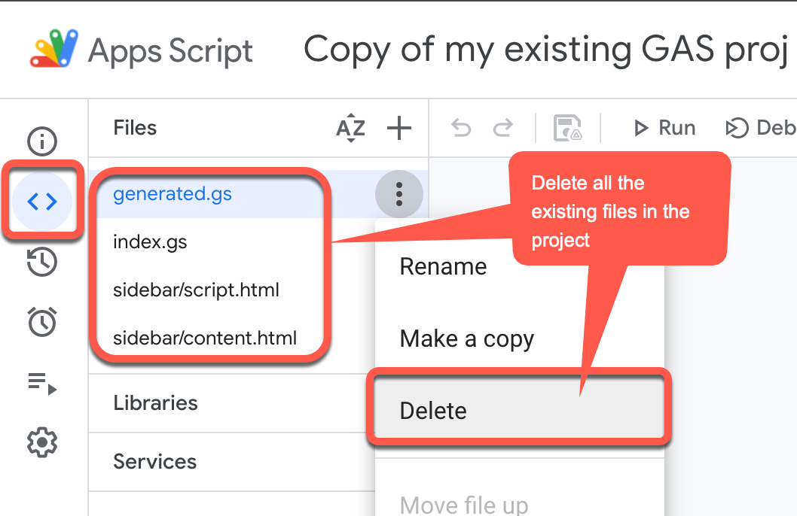</kbd><br/>

4. Add a new empty script file and call it `Code.gs`
<br/><br/><kbd>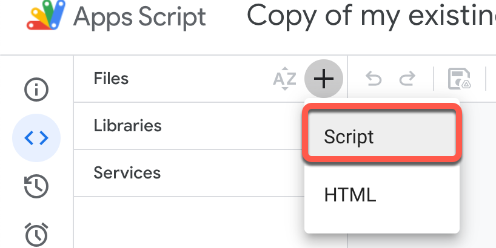</kbd><br/><br/>
</details>

Copy the code from the `gas/appsscript.json` in this repo, and paste it into `appsscript.json` in the Apps Script editor.
https://github.com/mhadianfard/gSheetAgent/blob/66c00008b8edca518f0f9cc733fea62813da4e92/gas/appsscript.json#L1-L10
<kbd>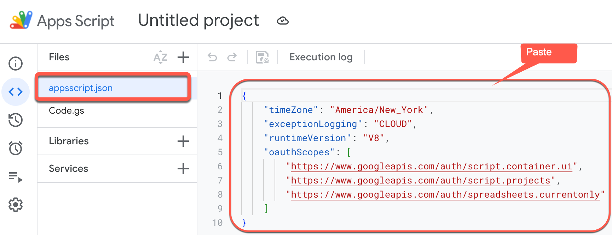</kbd>

Go to the `Editor` section from the left panel, and select `Code.gs` from the file list.
Copy the code from the `gas/start.js` in this repo, and paste it into `Code.gs` in the Apps Script editor.
https://github.com/mhadianfard/gSheetAgent/blob/66c00008b8edca518f0f9cc733fea62813da4e92/gas/start.js#L1-L132
<kbd>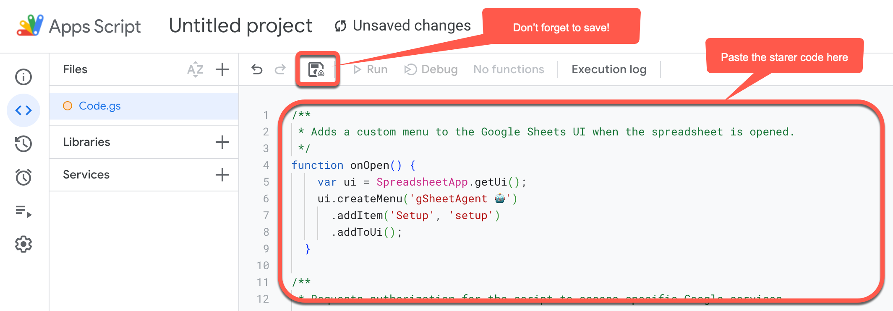</kbd>


### Step 5.
Go back to your spreadsheet and refresh the browser window - you may close all other tabs.
When the spreadsheet loads again, you will see a new menu item called `gSheetAgent`.
Navigate to `gSheetAgent` > `Setup`.

You will be prompted to authorize permissions required for gSheetAgent to function.
The prompt will warn you that this is an unverified app. Once again, this is because an official add-on would never be able to generate executable code, hence the need for us to go through all these steps to make it available. Click `Continue` to proceed.
<br/><br/><kbd>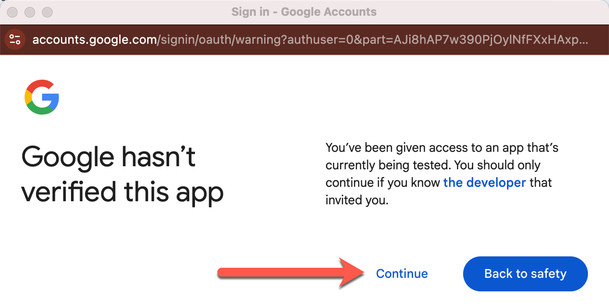</kbd>

You should now have full access to gSheetAgent!

<br/>
<br/>

## How to set up for development

This guide will help you set up a local development environment for the gSheetAgent project

### Prerequisites

- Node.js 22.0.0 or higher
- Git
- An OpenAI API key
- A Google Cloud Platform account

### Getting Started

#### 1. Clone the Repository

```sh
git clone https://github.com/mhadianfard/gSheetAgent.git
cd gSheetAgent
```

#### 2. Install Dependencies

```sh
npm install
```

#### 3. Set Up Environment Variables

Create a `.env` file in the root directory and configure the following variables:

```env
# OpenAI Configuration
OPENAI_API_KEY=your_openai_api_key
OPENAI_MODEL=gpt-4o  # or another model

# Google Configuration
GOOGLE_CREDENTIALS_PATH=credentials.json
GOOGLE_TOKEN_PATH=token.json
SCRIPT_ID=your_google_script_id
GAS_DIRECTORY=gas

# Server Configuration
PORT=5000

# AWS Configuration (for deployment)
AWS_REGION=ca-central-1
AWS_PROFILE=serverless-deploy
```

#### 4. Set Up Google Cloud Project

>[!TIP]
> Follow the steps in the [How to set up for use](#how-to-set-up-for-use) section for more details on how to set up a Google Cloud Platform project and enable the necessary APIs.

1. Create a new project on [Google Cloud Console](https://console.cloud.google.com/)
2. Enable the Google Apps Script API
3. Configure OAuth consent screen:
   - Select "External" user type
   - Add scopes for Google Apps Script and Google Sheets
   - Add test users (your Google email)
4. Create OAuth credentials:
   - Application type: Web application
   - Add authorized redirect URI: `http://localhost:5000/` (uses the PORT from your config)
   - Download the credentials JSON file and save it as `credentials.json` in the project root. This is only needed if you intend to run `upload-gas.js` (more later).

#### 5. Get Google Authentication Token (optional)

If you want to run `upload-gas.js` to upload the generated code to your Google Apps Script project, you'll need to get an authentication token. Run the authentication helper script:

```sh
node upload-gas.js
```

This will:

1. Open a browser window for authentication
2. Ask you to select your Google account
3. Ask for consent to access Google APIs
4. Save the authentication token to `token.json`

#### 6. Setup Google Apps Script

1. Create a new Google Sheet
2. Create a new Apps Script project (Extensions > Apps Script)
3. You have two options here:
  - **Option A.** You can follow the steps in the [How to set up for use](#how-to-set-up-for-use) and use the starter code to proceed.
  - **Option B.** You can use the `upload-gas.js` script to upload the main Google Apps Script code to your project. To do this, note the Script ID from the URL: `https://script.google.com/home/projects/SCRIPT_ID/edit` and add it to your `.env` file as `SCRIPT_ID`.

### Running the Application

#### Uploading Google Apps Script Code
You can deploy the main Google Apps Script code to your Google Apps Script project, using the `upload-gas.js` script shown below. 
> [!NOTE]
> You would need to have a valid authentication token in `token.json` as described in Step 5, for this to work. Also you would have had to specify a `SCRIPT_ID` in your `.env` file as per Step 6.

```sh
node upload-gas.js
```
Once code is uploaded into your Google Apps Script project, go to your spreadsheet, refresh the browser window and you should see the new `gSheetAgent` menu item. Select `Setup` to begin. This will initialize the add-on and set up necessary properties. After setup is complete, you'll be able to use the `Open Sidebar` option to access the agent.

<kbd>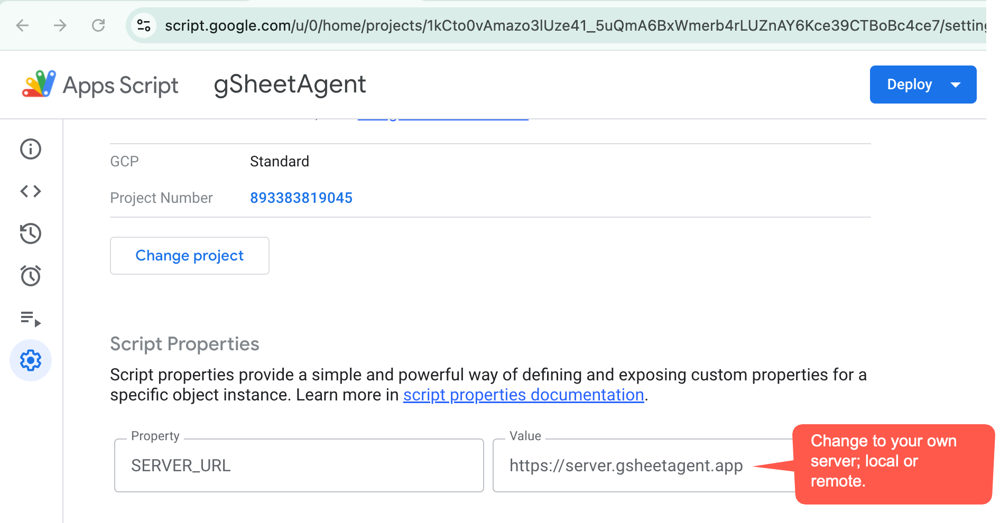</kbd>


#### Start the Local Server

Run the local server to handle API requests from the Google Apps Script:

```sh
node server/local.js
```

The server will start on `http://localhost:5000` with the following endpoints:

- `POST /prompt` - For handling LLM code generation requests
- `GET /setup` - For initializing the Google Apps Script setup

### Deployment (Optional)

#### Deploy to AWS Lambda

1. Configure AWS CLI credentials:

```sh
aws configure --profile serverless-deploy
```

2. Run the deployment script:
> [!NOTE]
> The deployment script has ample documentation written inside it. Read for more details.
```sh
node aws/deploy.js
```

3. Set up a custom domain (optional):
> [!NOTE]
> The domain setup script has ample documentation written inside it. Read for more details.
```sh
node aws/setup-custom-domain.js <lambda-url> <certificate-arn> <hosted-zone-id>
```

### Directory Structure

```
/                       - Project root
├── src/                - Core backend application code
│   ├── config/         - Configuration management
│   ├── google/         - Google API integration
│   ├── web/            - Express server app, routes and middleware
│   │   ├── routes.js
│   │   ├── app.js
│   │   └── middleware/
│   └── llm/            - LLM integration
├── gas/                - Google Apps Script code, acting as client
│   ├── appsscript.json - Google Apps Script manifest file
│   ├── start.js        - Main GAS entry point
│   └── sidebar/        - Sidebar HTML and JavaScript resources
├── server/             - Server implementation files
│   ├── lambda.js       - AWS Lambda entry point
│   └── local.js        - Local development server
├── aws/                - AWS deployment scripts
│   ├── deploy.js       - AWS Lambda deployment script
│   ├── template.yaml   - CloudFormation template
│   ├── lambda-include.txt - Files to include in Lambda package
│   └── domain-setup.js - Custom domain setup script
├── scripts/            - Utility scripts
│   └── upload-gas.js   - Script for uploading GAS code
├── utils/              - Utility functions and helpers
│   └── build.js        - Build information generator
├── docs/               - Documentation files and images
├── .env                - Environment variables
├── package.json        - Node.js dependencies
└── README.md           - Project documentation
```

### Additional Resources

- [OpenAI API Documentation](https://platform.openai.com/docs/)
- [Google Apps Script Documentation](https://developers.google.com/apps-script)
- [AWS Lambda Documentation](https://docs.aws.amazon.com/lambda/)

## License

Copyright (c) 2025 MoseyTech Consulting Inc.

This project is available as open source under the terms of the MIT License, with the following additional provisions:

1. The core functionality of this software is freely available for use, modification, and distribution according to the MIT License terms.

2. MoseyTech Consulting Inc. reserves exclusive rights to privately extend, develop, and commercially deploy any enhancements to the language model (LLM) integration and code generation capabilities of this software.

3. Contributions to this project are welcome and will be subject to the same license terms upon acceptance.

4. Any use of the MoseyTech name, logo, or other branding elements requires prior written permission.

For commercial use or licensing inquiries beyond the scope of this license, please contact MoseyTech Consulting Inc.

The full MIT License text can be found in the [LICENSE](./LICENSE) file in this repository.


## Contact

For questions, support, or inquiries about this project, please contact:

- **Developer:** [Mohsen Hadianfard](https://linkedin.com/in/mhadianfard)
- **Email:** mohsen@moseytech.ca
- **Organization:** MoseyTech Consulting Inc.

