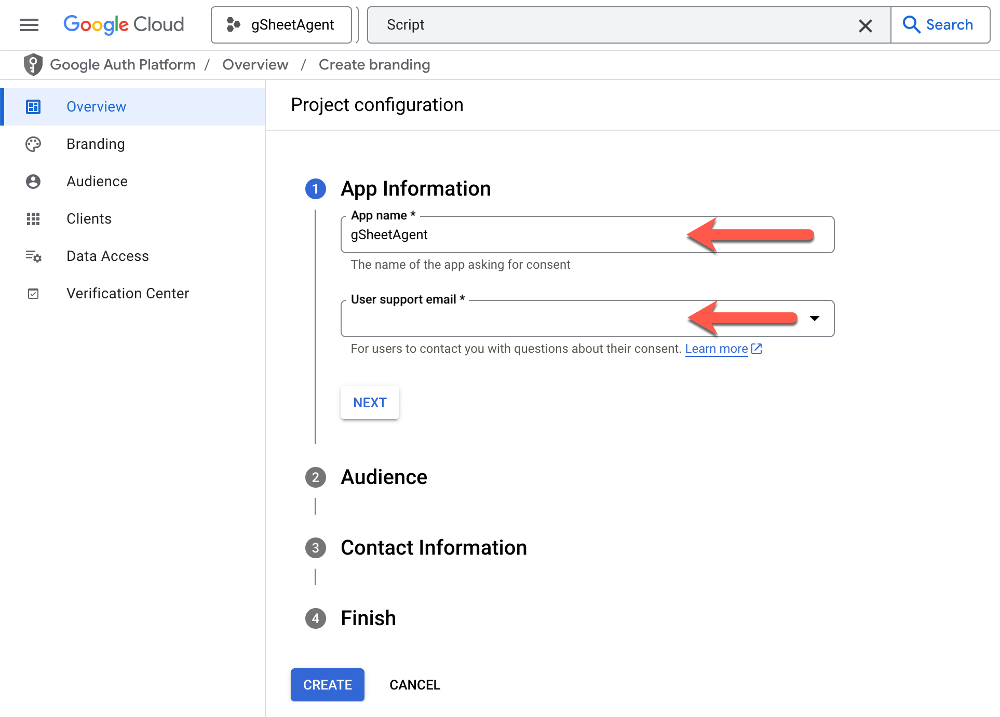

# gSheetAgent
An experimental agentic AI assistant for Google Sheets.

## How it works
gSheetAgent allows the user to explain what they want to do in natural language, and the agent will use an LLM model to generate the necessary Google App Script [code](https://developers.google.com/apps-script) to perform the action. The agent will also generate a detailed explanation of the code it has written, and the user can then run the code if they wish. The generated code is automatically uploaded to the Script project associate with the spreadsheet so it can be executed once the user has reviewed the explanation.

## How to set up for use
gSheetAgent needs to generate dynamic code and make it available for the user to run. For this reason, it requires some elevated privileges in Google Cloud Platform which requires some manual configuration. For this reason, it's not possible to publish this app as an official add-on to Google Sheets.

**Disclaimer:** This is an experimental project. You should use with caution. The generated code can always be reviewed by you before execution. The developer of this project is not responsible for any issues that may occur as a result of using it.

Here are the steps to get this onto **each** of your Google Sheets:

### Step 1. 
Go to your spreadsheet and click on `Extensions` > `Apps Script`

### Step 2.
Navigate to the `Project Settings` from the left panel of the Apps Script editor and check the box which reads 'Show "appsscript.json" manifest file in editor'.

### Step 3.
Now we need to associate the our new Script project with a Google Cloud Platform project so we can enable the necessary APIs. This is required so the agent can build dynamic code and make it available for the user to run.

Is this the first time you're setting up gSheetAgent?

If this is the first spreadsheet you're setting up with gSheetAgent, there's a few extra steps you need to take. You'll need to create a new Google Cloud Platform project and enable the necessary APIs and setup oAuth access to the GCP project. Here's how you can do this:

1. While on the `Project Settings` of the Apps Script editor, click on "Change project" under the _Google Cloud Platform (GCP) project_ section.

2. As instructed on screen, follow the [Google Cloud Console link](https://console.cloud.google.com/home/) and login if necessary.
3. On the Google Cloud Console, create a new GCP project using one of the suggested methods in the screenshot or by navigating to [https://console.cloud.google.com/projectcreate](https://console.cloud.google.com/projectcreate).

4. Specify a name for your project, e.g. `gSheetAgent` - can be anything as long as you remember what it is later.
5. If you're on Google Workspace, you'll need to select an organization that you have access to.

6. Once you've created the project, use the search bar to find "App Script API". There's a few different ways to get there including directly navigating to [https://console.cloud.google.com/marketplace/product/google/script.googleapis.com](https://console.cloud.google.com/marketplace/product/google/script.googleapis.com). Either way, make sure you're in the context of the project you created in the previous step.

7. Enable the App Script API so that gSheetAgent can write code to your Script project.

8. Now you'll need to setup oAuth access to the GCP project. From the left panel of GCP console, navigate to `API and Services` > `OAuth consent screen`.

9. On the screen that follows, click `Get Started`.

10. On item #1, provide an app name you recognize (e.g. `gSheetAgent`), and provide an email address from the list. Proceed to item #2.

11. On item #2, you'll be asked if you want to publish your app internally or externally. We won't actually be publishing anything but if your organization allows to make the this available internally, it's the better way to go.

12. On item #3, you'll need to provide an email address for any possible alerts Google needs to send you for this app.

13. On item #4, agree to the user data terms and click `Create`.

14. Now, you have an oAuth configuration which was a requirement for the GCP project to be used for Google App Scripts. In step 11 above, if you had to choose "External" as your audience, you'll need to specify who's allowed to Test the app, otherwise no one can properly access the app. On the oAuth configuration screen, navigate to `Audience` and scroll down to the `Test users` section, then click `Add Users`.

15. Add **your** email address to the list, as well as any other person who might need to use gSheetAgent on one of YOUR spreadsheets. Any email address you provide must be on a gmail or Google Workspace account. At the end of this step, you might see a message telling you "Ineligible accounts not added". You can ignore this.

16. Go back to the GCP home page and copy the Project number. Make sure you're on the right GCP project.

17. Navigate back to the Apps Script editor (where you started at on this detour). Paste the Project number into the corresponding field under the _Google Cloud Platform (GCP) project_ section.

Have you already set up gSheetAgent on another spreadsheet?

If you've set up gSheetAgent on another spreadsheet, you would have already created a GCP project for it which you can reuse. Here's how you can do this:

i. In a new browser tab, navigate to the [Google Cloud Console](https://console.cloud.google.com/home/) and login if necessary.
ii. From the top drop-down, select the project we would have created last time - likely called "gSheetAgent"
iii. On the GCP home page copy the Project number.

iv. Go back to the first browser tab, select Project Settings from the left panel of the Apps Script editor and click on "Change project" under the _Google Cloud Platform (GCP) project_ section
v. Paste the Project number into the corresponding field in that section.

### Step 4.
**Important Note:**

Does your spreadsheet already have some customized code?

gSheetAgent needs a dedicated Apps Script project. If your spreadsheet already has some customized code, you'll need to create a new Script project and associate it with your spreadsheet before you copy the starter code over. Here's how you can do this:
a. Navigate to the Project Overview from the left panel of the Apps Script editor
b. Click on "Make a copy" in the top right corner

c. Navigate into the Editor from the left panel, and delete all the existing files in the project (except `appsscript.json`)

d. Add a new empty script file and call it `Code.gs`

Copy the code from the `gas/starter/appscript.json` in this repo, and paste it into `appsscript.json` in the Apps Script editor.
https://github.com/mhadianfard/gSheetAgent/blob/56e075d86923f0c795b3b40d97afc9a0fb7e9071/gas/starter/appsscript.json#L1-L10

Go to the `Editor` section from the left panel, and select `Code.gs` from the file list.
Copy the code from the `gas/starter/index.js` in this repo, and paste it into `Code.gs` in the Apps Script editor.
https://github.com/mhadianfard/gSheetAgent/blob/56e075d86923f0c795b3b40d97afc9a0fb7e9071/gas/starter/index.js#L1-L69

### Step 5.
Go back to your spreadsheet and refresh the browser window - you may close all other tabs.
When the spreadsheet loads again, you will see a new menu item called `gSheetAgent`.
Navigate to `gSheetAgent` > `Setup`.

You will be prompted to authorize permissions required for gSheetAgent to function.
The prompt will warn you that this is an unverified app. Once again, this is because an official add-on would never be able to generate executable code, hence the need for us to go through all these steps to make it available. Click `Continue` to proceed.

You should now have full access to gSheetAgent!
